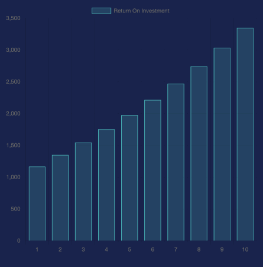
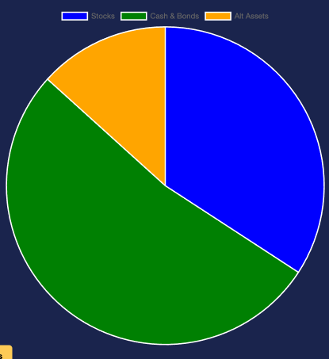
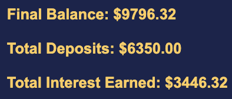

# Edge

### URL: https://harrisonlhl123.github.io/roi-calculator/

### Description:

Edge is a return on investment calculator. It takes in three categories of investments: Stocks, Cash and Bonds, and Alternative Assets. Each category has an initial balance, yearly contributions, expected returns, and years invested. From there, it displays a bar graph for each category showing the growth over time. Additionally, there will be two pie charts to show more data about your portfolio.

### Features and Implementations:

#### Rendering a bar graph:



Storing the years and return on investment as arrays allow us to make each individual bar graph.

```
// stocks.js

export function calculateROI(initialDeposit, yearlyDeposit, desiredReturns, yearsInvested) {
    const years = []; // Array to store years
    const roiValues = []; // Array to store ROI values

    for (let year = 1; year <= yearsInvested; year++) {
        // Calculate ROI for each year
        const roi = (initialDeposit * Math.pow((1 + desiredReturns/100), year)) +
                    (yearlyDeposit * (Math.pow((1 + desiredReturns/100), year) - 1) / (desiredReturns/100));
        
        // Push the year and ROI value into their respective arrays
        years.push(year);
        roiValues.push(parseFloat(roi.toFixed(2)));
    }

    // Last element in roiValues is the overall return
    const overallROI = roiValues[roiValues.length - 1];

    return {
        roi: parseFloat(overallROI.toFixed(2)),
        yearsInvested: yearsInvested,
        years: years, // Array of years
        roiValues: roiValues, // Array of ROI values
    };
}
```

#### Rendering a pie chart:



The pie chart is broken down into three categories. We store each category as a variable and use helper functions to make the pie chart.

```
// calculateAndDisplay.js

const roiData = calculateROI(initialDeposit, yearlyDeposit, desiredReturns, yearsInvested);
const roiData2 = calculateROICashAndBonds(initialDeposit2, yearlyDeposit2, desiredReturns2, yearsInvested2);
const roiData3 = calculateROIOtherAssets(initialDeposit3, yearlyDeposit3, desiredReturns3, yearsInvested3);
const portfolioData = calculatePortfolioData(roiData.roi, roiData2.roi2, roiData3.roi);
createPortfolioPieChart(portfolioData, canvas5);
```

#### Calculations:



Using the return on investment formula, we can calculate the final balance after a certain amount of years. From there, we can also derive the total deposits and total interests.

```
// calculateDepositInterest.js

const roi = (initialDeposit * Math.pow((1 + desiredReturns/100), year)) +
                    (yearlyDeposit * (Math.pow((1 + desiredReturns/100), year) - 1) / (desiredReturns/100));

const totalDeposits = initialDeposit + (yearlyDeposit * yearsInvested);
const totalInterest = roi - totalDeposits;
```

### Features in Development:

* Adding stocks to a watchlist with real time data.
* Updating articles on a daily basis related to the financial world.