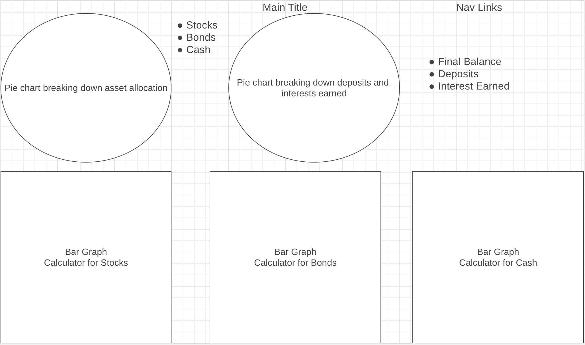

# Background:

The ROI Calculator is a calculator that takes in data and returns the final balance after a certain amount of years. It will take in an initial balance, yearly contributions, expected returns, and years invested. If time allows, I will also increase the complexity by allowing for returns on a combination of cash, bonds, and stocks. Two pie charts will be displayed side by side on the top of the screen. The first pie chart will divide the different types of assets in the portfolio. The second pie chart will show the deposits made by the user and the interest earned from their investments. Underneath those pie charts, there will be three categories for the users to fill out: stocks, bonds, and cash. Within each section, there will be inputs for the user to fill out(initial balance, yearly contributions, expected returns, years invested). After inputting the numbers, the calculator will yield a final balance along with a bar graph to show the investments growth over time.

# Functionality & MVPs:

## With the ROI Calculator, users will be able to:
* Input numbers to match their investment goals.
* Adjust numbers to see how that affects their final balance.
* See a bar graph that tracks their investment's growth over time.
* See two pie charts. The first will be an asset allocation breakdown of their portfolio. The second will be their deposits and the interest earned.

## In addition, this project will include:
* Recommened numbers for users who do not know what to put in a category.
* Prefilled version that represents market average.

# Technologies, Libraries, APIs:

## This project will be implemented with the following technologies:
* D3 for graphs
* Webpack to bundle JavaScript code

## Implementation Timeline:
* Thursday: This will mostly be a planning day. Research the technologies that I will be using and understand how I will use them. Compile all the links that I will need as potential resources. Make a comprehensive map of what I need to do for this project to run.
* Friday: Set up the project and use this time to ask questions about implementation. Play with D3 so that I feel comfortable making graphs. Implement my plan and work through the math logic behind this project.
* Weekend: Code out what I can, and compile a list of questions that I need answered on Monday in order to proceed with the project.
* Monday: Get answers for parts of the project that I am still unsure about. Work on the fixing those.
* Tueday: Finish up the project and start styling.
* Wednesday: Style and add bonus features.
* Thursday: Go through project to make sure everything is working the way they are supposed to.

# Checklist:

## Live Project:

☐ Includes links to your portfolio website, Github, and LinkedIn.

☐ Landing page/modal with obvious, clear instructions.

☐ Interactivity of some kind.

☐ Well styled, clean frontend.

☐ If it has music, the option to mute or stop it.

## Production README

☐ Link to live version.

☐ Instructions on how to play/interact with the project.

☐ List of technologies / libraries / APIs used.

☐ Technical implementation details with (good-looking) code snippets.

☐ To-dos / future features.

☐ No .DS_Store files / debuggers / console.logs.

☐ Organized file structure, with /src and /dist directories.